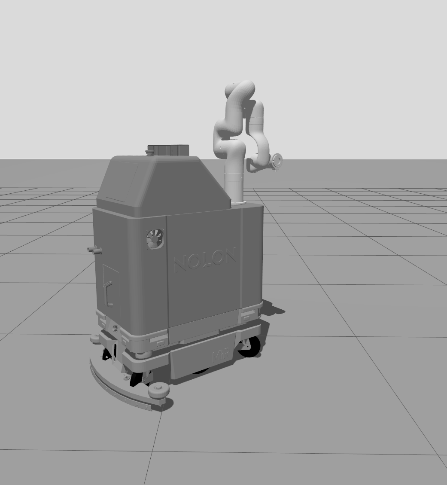
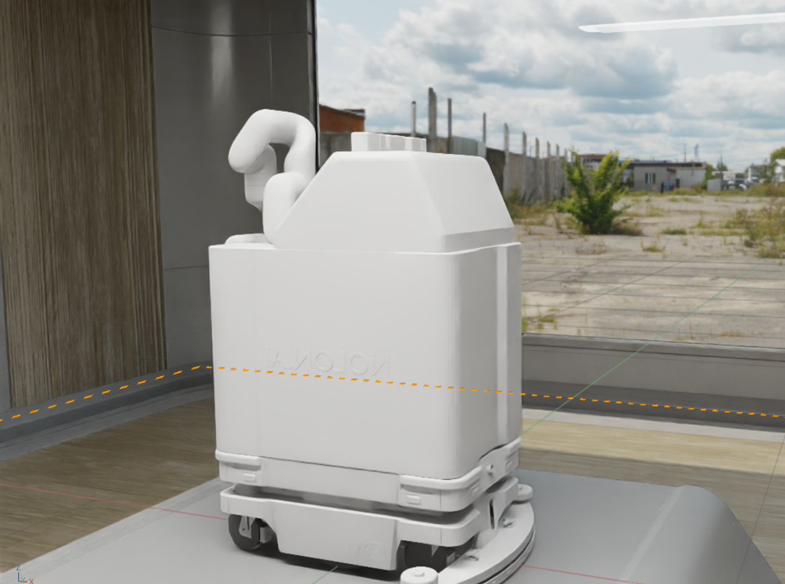

# Nolon Bot

A comprehensive ROS2 package for a mobile manipulator robot with navigation, mapping, and manipulation capabilities.

## Overview

The Nolon Bot is a mobile manipulator system that combines:
- **Mobile Base**: Differential drive robot with omnidirectional wheels
- **Robotic Arm**: 6-DOF manipulator arm with end-effector
- **Sensors**: Lidar for navigation and camera for perception
- **Containment System**: Specialized tools for cleaning applications

<div align="center">

</div>

## Features

- **ROS2 Jazzy** support with Gazebo simulation
- **SLAM** mapping using Nav2 stack
- **Autonomous Navigation** with obstacle avoidance
- **MoveIt2** motion planning for the robotic arm
- **Teleoperation** support for manual control
- **Docker** containerized deployment
- **RViz** visualization configurations
- **USD** format support for advanced simulation

## System Requirements

- **OS**: Ubuntu 24.04 LTS
- **ROS2**: Jazzy Jalisco
- **Gazebo**: Latest version
- **Docker**: 20.10+ with Docker Compose v2
- **Hardware**: Minimum 4GB RAM, GPU recommended for simulation

## Quick Start with Docker

### 1. Clone the Repository
```bash
git clone https://github.com/aayush-rath/Nolon-simulation-stack.git
cd Nolon-simulation-stack
```

### 2. Build and Run with Docker Compose
```bash
# Setup Docker environment
chmod +x setup-docker.sh
./setup-docker.sh

# Build the Docker image
docker compose build

# Run the complete system
docker compose up

# For headless operation
docker compose up -d
```

### 3. Access the System
- **RViz**: Connect to the container's display
- **Gazebo**: GUI will be available through X11 forwarding
- **Logs**: `docker compose logs -f`

## Native Installation

### Dependencies
```bash
# Install ROS2 Jazzy
sudo apt update
sudo apt install ros-jazzy-desktop-full

# Install additional packages
sudo apt install \
    ros-jazzy-navigation2 \
    ros-jazzy-nav2-bringup \
    ros-jazzy-moveit \
    ros-jazzy-moveit-servo \
    ros-jazzy-gazebo-ros-pkgs \
    ros-jazzy-joint-state-publisher-gui \
    ros-jazzy-robot-state-publisher \
    ros-jazzy-ros2-control
```

### Build from Source
```bash
# Create workspace
mkdir -p ~/nolon_ws/src
cd ~/nolon_ws/src

# Clone repository
git clone <your-repo-url> .

# Install dependencies
cd ~/nolon_ws
rosdep install --from-paths src --ignore-src -r -y

# Build
colcon build --symlink-install

# Source the workspace
source install/setup.bash
```

## Usage

### 1. Simulation
Launch the complete simulation environment:
```bash
ros2 launch nolon_bot_description sim.launch.py
```

### 2. Mapping
Create a map of the environment:
```bash
# Start mapping
ros2 launch nolon_bot_description mapping.launch.py

# Save the map when done
ros2 run nav2_map_server map_saver_cli -f ~/maps/my_map
```

### 3. Navigation
Navigate autonomously using the created map:
```bash
ros2 launch nolon_bot_description navigation.launch.py
```

### 4. Manipulation
Control the robotic arm with MoveIt2:
```bash
ros2 launch nolon_bot_description move_group.launch.py
```

### 5. Teleoperation
Manual control of the robot:
```bash
# Keyboard teleoperation
ros2 run teleop_twist_keyboard teleop_twist_keyboard

# Or use the custom teleop nodes
ros2 run nolon_bot_description teleop_node
ros2 run nolon_bot_description teleop_force_node
```

## Package Structure

```
Nolon-simulation-stack/
├── docker-compose.yml
├── Dockerfile
├── setup-docker.sh
├── LICENSE
├── README.md
├── images/
│   └── Nolon_Bot.png
├── nolon_bot/                    # USD configuration files
│   ├── configuration/
│   │   ├── nolon_bot_base.usd
│   │   ├── nolon_bot_physics.usd
│   │   └── nolon_bot_sensor.usd
│   └── nolon_bot.usd
└── nolon_bot_description/        # Main ROS2 package
    ├── CMakeLists.txt
    ├── package.xml
    ├── config/                   # Configuration files
    │   ├── nolon_bot_control.yaml
    │   ├── nolon_bot_mapper.yaml
    │   ├── nolon_bot_navigation.yaml
    │   └── nolon_gz_bridge.yaml
    ├── launch/                   # Launch files
    │   ├── sim.launch.py
    │   ├── mapping.launch.py
    │   ├── navigation.launch.py
    │   └── move_group.launch.py
    ├── maps/                     # Saved maps
    │   ├── map.pgm
    │   └── map.yaml
    ├── meshes/                   # 3D models
    │   ├── mobile_base/          # Base platform meshes
    │   ├── robotic_arm/          # Manipulator arm meshes
    │   ├── sensors/              # Sensor meshes (Lidar, cameras)
    │   ├── containment/          # Containment system meshes
    │   ├── toilet_brush.stl      # Cleaning tools
    │   ├── urinal_nozzle.stl
    │   ├── some_tool.stl
    │   ├── ee.stl
    │   └── fj.stl
    ├── moveit_config/            # MoveIt2 configurations
    │   ├── joint_limits.yaml
    │   ├── kinematics.yaml
    │   ├── moveit_controllers.yaml
    │   ├── ompl_planning.yaml
    │   └── servo.yaml
    ├── rviz/                     # RViz configurations
    │   ├── moveit.rviz
    │   ├── nolon_bot_mapper.rviz
    │   ├── nolon_bot_moveit.rviz
    │   └── nolon_bot_navigation.rviz
    ├── src/                      # Source code
    │   ├── teleop_node.cpp
    │   └── teleop_force_node.cpp
    ├── srdf/                     # Semantic robot descriptions
    │   └── robotic_arm.srdf.xacro
    ├── urdf/                     # Robot descriptions
    │   ├── nolon_bot.urdf.xacro  # Main robot definition
    │   ├── sample.urdf.xacro     # Sample/test robot
    │   ├── mobile_base/          # Base platform URDF
    │   │   ├── mobile_base.urdf.xacro
    │   │   └── mobile_base.control.xacro
    │   ├── robotic_arm/          # Manipulator URDF
    │   │   ├── robotic_arm.urdf.xacro
    │   │   └── robotic_arm.control.xacro
    │   ├── sensors/              # Sensor definitions
    │   │   ├── camera.sensor.xacro
    │   │   └── lidar.sensor.xacro
    │   └── containment/          # Containment system URDF
    │       ├── containment.urdf.xacro
    │       └── containment_box.urdf.xacro
    └── world/                    # Gazebo worlds
        ├── empty_world.sdf
        └── not_so_empty_world.sdf
```

## Configuration

### Navigation Parameters
Edit `config/nolon_bot_navigation.yaml` to tune:
- Global planner settings
- Local planner parameters
- Costmap configurations
- Recovery behaviors

### MoveIt2 Configuration
Modify files in `moveit_config/`:
- `joint_limits.yaml`: Joint constraints
- `kinematics.yaml`: Kinematics solvers
- `ompl_planning.yaml`: Motion planning algorithms
- `servo.yaml`: Real-time servo control
- `moveit_controllers.yaml`: Controller configurations

### Control Parameters
Adjust `config/nolon_bot_control.yaml` for:
- Joint controllers
- Differential drive controller
- Hardware interface settings

### Gazebo Bridge
Configure `config/nolon_gz_bridge.yaml` for:
- Topic bridging between ROS2 and Gazebo
- Message type mappings
- Communication protocols

## Advanced Features

### USD Support (Isaac Sim Integration)
<div align="center">

</div>
The robot includes USD (Universal Scene Description) files for Isaac Sim compatibility:
- `nolon_bot.usd`: Main robot USD file for Isaac Sim
- `configuration/`: Modular USD components for Isaac Sim
  - `nolon_bot_base.usd`: Base platform geometry
  - `nolon_bot_physics.usd`: Physics properties
  - `nolon_bot_sensor.usd`: Sensor configurations

These USD files enable direct import and simulation of the Nolon Bot in NVIDIA Isaac Sim, providing advanced physics simulation, photorealistic rendering, and AI/ML training capabilities.

### Custom Worlds
Two predefined Gazebo worlds are available:
- `empty_world.sdf`: Minimal environment for testing
- `not_so_empty_world.sdf`: Complex environment with obstacles

### Specialized Tools
The robot includes cleaning-specific end-effectors:
- `toilet_brush.stl`: Rotating brush for surface cleaning
- `urinal_nozzle.stl`: Liquid dispenser for sanitization
- `some_tool.stl`: Generic tool interface

### Sensor Suite
Comprehensive sensor package includes:
- RGBD cameras (using RealSense D435/D455 CAD models for geometry)
- Lidar for navigation and mapping
- Custom camera mounts and holders

## Development

### Adding New Components
1. **Meshes**: Add STL/DAE files to appropriate `meshes/` subdirectory
2. **URDF**: Create xacro files in corresponding `urdf/` subdirectory
3. **Configuration**: Update relevant YAML files in `config/`
4. **Launch**: Modify launch files to include new components

### Custom Behaviors
Implement custom navigation behaviors by:
1. Creating plugins for Nav2
2. Adding behavior trees
3. Configuring in `nolon_bot_navigation.yaml`

### Teleoperation Development
Two teleoperation nodes are available:
- `teleop_node.cpp`: Standard teleoperation
- `teleop_force_node.cpp`: Force-feedback teleoperation

### Testing
```bash
# Run unit tests
colcon test --packages-select nolon_bot_description

# Check code style
ament_flake8 src/
ament_cpplint src/
```

## Troubleshooting

### Common Issues

**Docker Setup Issues**
```bash
# Run the setup script
chmod +x setup-docker.sh
./setup-docker.sh

# Check Docker installation
docker --version
docker compose version
```

**Gazebo Bridge Problems**
```bash
# Check bridge configuration
ros2 topic list | grep gz
# Verify bridge topics
ros2 run ros_gz_bridge parameter_bridge --help
```

**MoveIt2 Planning Fails**
```bash
# Check SRDF configuration
ros2 param get /move_group robot_description_semantic
# Verify controller configuration
ros2 control list_controllers
```

### Performance Optimization

**For Docker deployment:**
- Use GPU acceleration when available
- Optimize container resource limits
- Mount volumes for persistent data

**For native installation:**
- Compile with optimizations (`colcon build --cmake-args -DCMAKE_BUILD_TYPE=Release`)
- Tune navigation and control parameters
- Use appropriate sensor frequencies

## Contributing

1. Fork the repository
2. Create a feature branch
3. Make your changes following ROS2 conventions
4. Update documentation as needed
5. Add tests if applicable
6. Submit a pull request

## License

This project is licensed under the MIT License - see the LICENSE file for details.

## Support

For issues and questions:
- Create GitHub issues for bugs and feature requests
- Use discussions for general questions
- Check the package documentation

## Acknowledgments

- ROS2 Navigation2 team
- MoveIt2 developers
- Gazebo simulation community
- NVIDIA Isaac Sim team
- Open source robotics community
- Universal Scene Description (USD) community